<picture>
  <source media="(prefers-color-scheme: dark)" srcset="./assets/hero-dark.svg">
  
</picture>

I'm an AI & Data Engineer at Grosvenor Engineering Group in Sydney, building the enterprise context layer.

It connects every data source in the business, from real-time telemetry and operational databases to documents, files, APIs and SaaS systems, through a shared ontology that models not only what exists but how the business makes decisions.

- **Connect**: one ontology across assets, sensors, documents, people and work.
- **Reason**: AI agents grounded in that full context, not one system at a time.
- **Act**: insights become recommendations, and recommendations become controlled actions. Every action is permissioned, auditable and written back to the systems where the work happens.

[zeyuchen.dev](https://zeyuchen.dev) · [LinkedIn](https://linkedin.com/in/zeyuchen-zach)
